# Hungarian Patch Swap

A cute algorithim for style transfer

## Files

- `style_patch_match.py`: Performs style transfer using patch-based matching.
- `README.md`: This file.
- `requirements.txt`: Lists Python dependencies.

## Requirements

Install the required packages:

```bash
pip install -r requirements.txt
```

## Usage

This code is very exipsnive to run for combinations of large img_height/img_width with small patch sizes, ive tested with good quick results for 512 Width/Height and 8x8 patches. 

More instructions coming soon :)

```bash
python style_patch_match.py --style path/to/style.jpg --content path/to/content.jpg --img_height 256 --img_width 256 --patch_h 8 --patch_w 8 --feature_type greyscale --comparison_metric l2 --out_dir output
```
## Demo Images (leftmost image is the style thats being transfered)

### Lorem Ipsum Style Demo (8×8 patches)
| 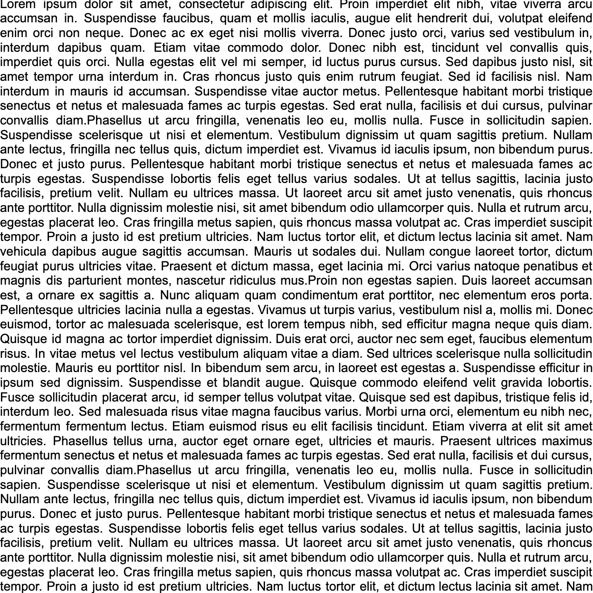<br>**Lorem Ipsum** | 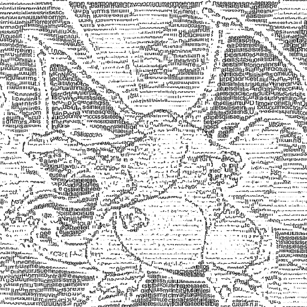<br>**Stylized Charizard** | 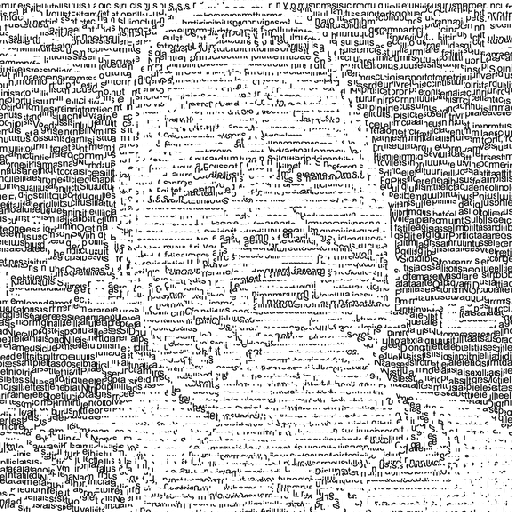<br>**Stylized Rizzler** | 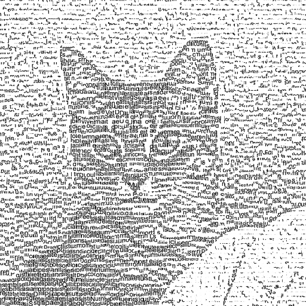<br>**Stylized Snow** | 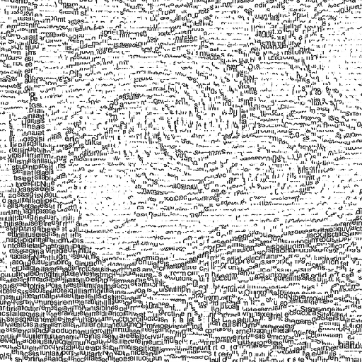<br>**Stylized Starry Night** |
|---|---|---|---|---|

### Starry Night Style Demo (8×8 patches)
| 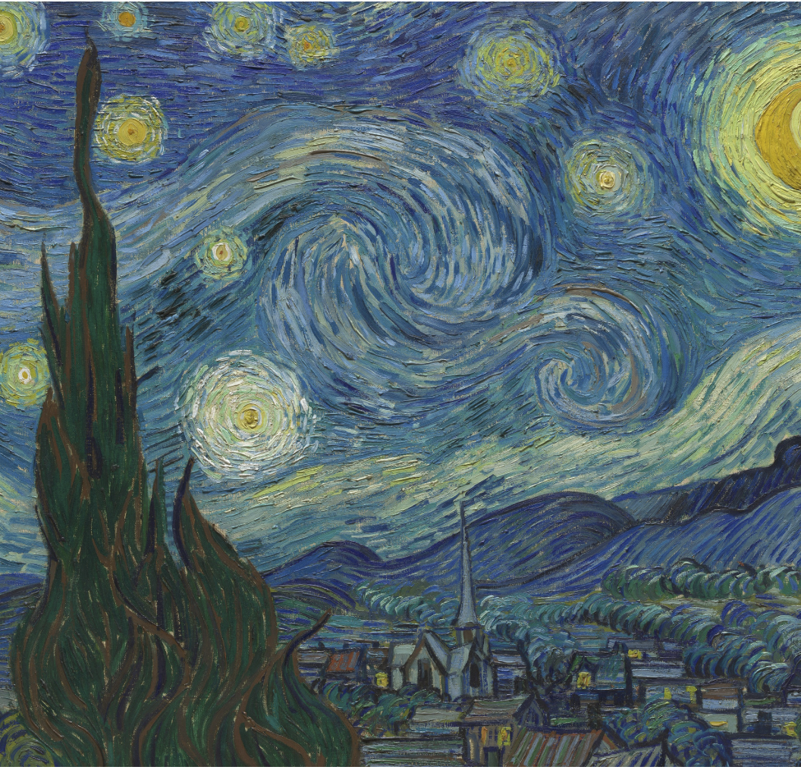<br>**Starry Night** | 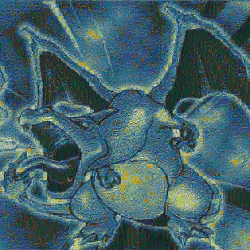<br>**Stylized Charizard** | 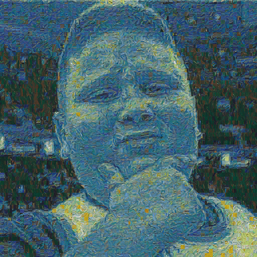<br>**Stylized Rizzler** | 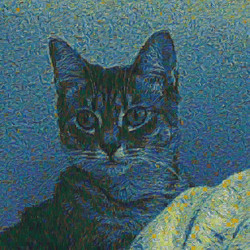<br>**Stylized Snow** | 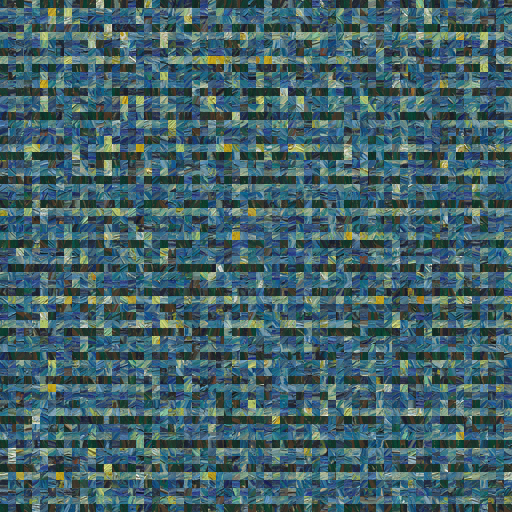<br>**Stylized Lorem Ipsum** |
|---|---|---|---|---|

### Starry Night Style Demo (16×16 patches)
| <br>**Starry Night** | 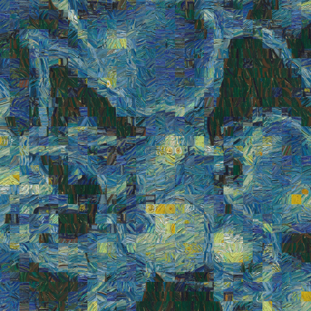<br>**Stylized Charizard** | 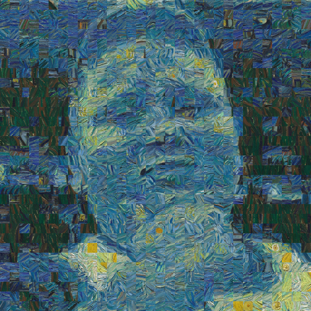<br>**Stylized Rizzler** | 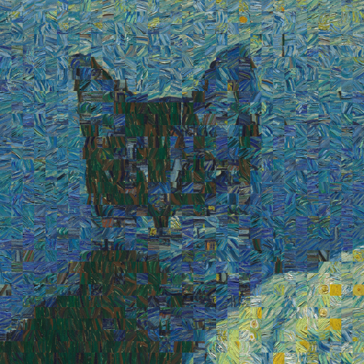<br>**Stylized Snow** | 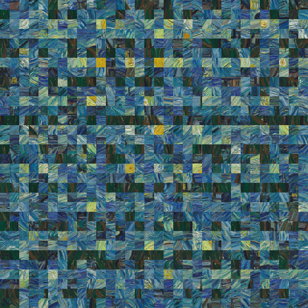<br>**Stylized Lorem Ipsum** |
|---|---|---|---|---|
